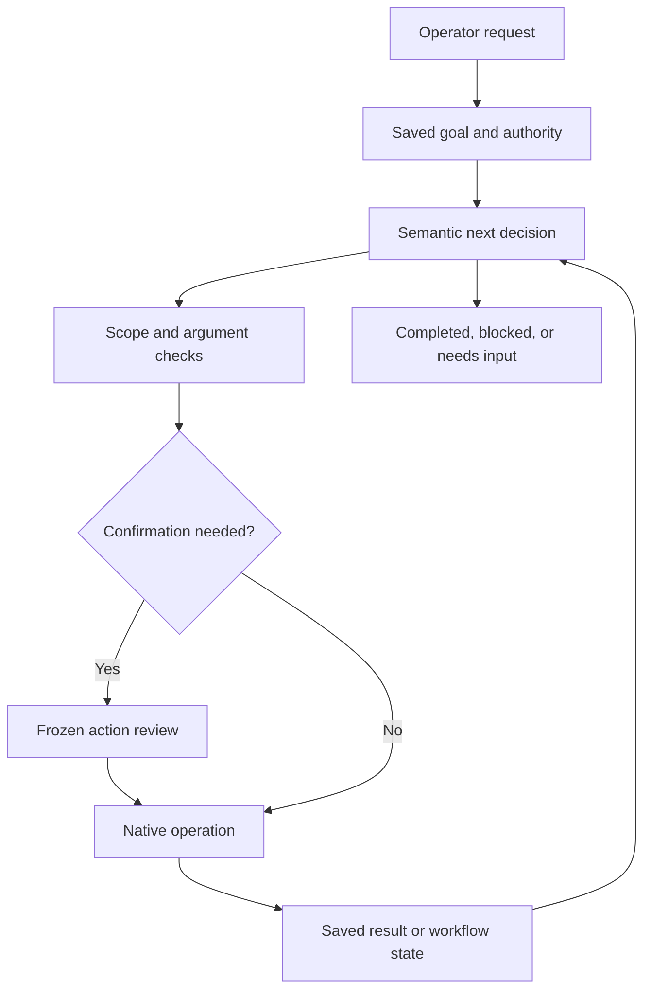

# AI interconnection audit — accepted main df17f16

## Finding

The LLM is still used as a constrained plan classifier and answer writer, rather
than a durable goal executor. PR #235 repaired semantic follow-ups and grounded
binding; it did not connect every native system or implement an agent loop.

## Evidence and consequences

| Connection | Evidence in code | Consequence |
| --- | --- | --- |
| Initial context → planning | `api/command_center.py` builds `planning_context` from history, selections and proposals before reading channel state | A new thread cannot reason from channel identity, configuration or production constraints |
| Language → clip retrieval | `services/command_center.py:best_clips` extracts literal words, defaults to today, fixes five results | Clear paraphrases can yield empty results; an unstated date restriction hides stored content |
| Channel → clip retrieval | `best_clips` searches scored clips globally; channel scoring does not establish ownership | A channel can receive candidates from another channel |
| Background result → next decision | Proposal context includes startup result; `command_activity` separately computes terminal state/events | Follow-ups can reason from stale “workflow started” evidence despite completed or failed work |
| Observation → binding authority | The second plan replaces the first without validating its action set or execution mode | An observation can introduce an operation or promote a preview to execution |
| Heavy planning → provider | `planner_provider_order` always prefers the conversation provider, including binding | Agent-provider preference applies to narration but not the consequential planning round |
| Retained knowledge → planning | Retained intelligence/trend evidence is available through typed attachments, not a general inspection | The model cannot independently consult this material before suggesting content |
| Systems → tools | `COMMAND_ACTION_SCOPES` exposes five operations | Native source/topic settings, voice, branding, review and publishing endpoints remain outside the agent |
| Async work → goal completion | A command launches workflows and returns; lifecycle callbacks record events | No generic goal scheduler resumes reasoning when search/analysis/render completes |
| Retrieval → reasoning | Fixed inspections and one binding round; source identity/edit recipe/recovery target still have heuristic selection | No adaptive read loop, query refinement, dependency graph, or general prerequisite repair |
| Tests → language reliability | Semantic tests mock planner outputs | Green CI proves contracts; it does not measure real paraphrase comprehension or provider availability |
| Transport → recovery | Each command creates a new server request UUID; proposal idempotency applies only after proposal creation | Resubmitting a lost direct-command response can create a second proposal/workflow |
| Latency → transport | Launcher API proxy uses a 120-second timeout; command rounds can each attempt several providers, Codex requests use 60 seconds | Provider timeouts are bounded individually, but there is no total command deadline or durable asynchronous command receipt |

## Required architecture

Use a typed capability catalog shared by planning and execution; scope-filter tools
per actor and channel. Supply current channel constraints and fresh observations.
Let the model select tool arguments and subsequent reads, with bounded steps/time/
budget and server validation. Persist a goal, ordered dependencies, authorization,
observations, and completion criteria. Resume through durable workflow events,
without requiring another operator message. Report waiting, blocked, failed and
completed distinctly. Existing publication approval and rights checks remain authoritative.

General knowledge may support labeled strategy and hypotheses; measured operational
claims require stored or retrieved evidence. Blocking invented facts must not prohibit
reasoning from evidence or cause the system to invent unavailable next steps.

## Scope of this pass

Repair verified context, retrieval, feedback, binding-authority and provider-routing
connections with regression coverage. Document rather than claim completion of
generic autonomous continuation, missing native tools, semantic source/recipe
resolution, and live model evaluation. No live provider results are fabricated.

## Repairs in this draft

- `command_environment` supplies current channel identity/timezone/local date,
  interests/exclusions, brand/ranking constraints, budget ceiling, and bounded
  source/recipe identities before the first plan. It reads rather than creates
  configuration; connection secrets/arbitrary profile metadata are omitted.
- The authenticated actor's action permissions are supplied to planning. The
  existing server permission checks remain authoritative before execution.
- Semantic clip lookup now accepts validated topic alternatives, time period and
  candidate count. With no requested date it searches all stored discovery dates;
  the older literal/today behavior remains only for the explicit offline route.
  Both routes now require channel ownership through the existing clip library
  lineage service. Retrieval still has a 250-row scored candidate pool limit.
- `research_context` exposes active retained intelligence and unexpired channel
  trend opportunities as a read capability. Model-interpreted optional topic terms
  filter saved data, with four research and four trend results per lookup.
  These records do not count as acquired media or live collection results.
- Fresh proposal activity, terminal state, terminal detail and resource status
  reach planning and narration on each subsequent turn. This reconnects feedback
  on operator turns; it does **not** wake an agent autonomously on completion.
- Observation binding uses the configured agent-provider preference. Paid fallback
  stays opt-in. A bound plan cannot add operations, promote proposals to execution,
  turn one-time work into recurring work, or add production preparation.
- Narration explicitly permits labeled inferences and reasoned strategy while
  retaining evidence requirements for operational facts.

## Remaining priorities

1. **Durable agent loop and transport receipt.** Persist an operator command identity
   and goal before inference; acknowledge it independently of a long HTTP request.
   Resume bounded reasoning from workflow outcomes, preserve authorization and
   idempotency across retries, and verify the goal's completion criteria.
2. **Shared typed capability catalog.** Readiness, permissions, argument/result
   schemas, prerequisites and handlers must come from the same catalog. Add native
   source/watch management, clip acquisition/review, editorial/voice/brand settings,
   recovery/cancellation and publication tools using their existing gates. Do not
   expose arbitrary APIs or infer publishing approval from unrelated preparation.
3. **Adaptive retrieval and semantic binding.** The model must be able to refine
   a query, choose another read, resolve a specific source/recipe/recovery target,
   and retrieve beyond the current bounded snapshots. Current source matching,
   recipe inference and first-failed-render choice still contain heuristics.
   Changing the selected model cannot supply missing capabilities.
4. **Live evaluations.** Evaluate actual configured providers on paraphrases,
   correction, negation, unclear identities, mixed goals, unavailable integrations,
   partial results, delayed completion, retries and goal completion. Score correct
   tool arguments and outcomes, not merely fluent answers. Tests must distinguish
   model evaluation from deterministic execution-contract checks.

## Validation

The regression suite includes real isolated SQLite saved-data retrieval and
lifecycle integration, plus the command handler with mocked model outputs. It
tests channel isolation, unstated dates, seven candidates, topic alternatives,
active retained research, current trends, terminal failure feedback, first-round
context/permissions, and prevention of observation-round authority expansion.
Full PostgreSQL CI and live provider evaluation are separate acceptance layers.

## Follow-through: durable goal execution (2026-10-02)

The sections above describe the accepted-main baseline and the first repairs.
This follow-through implements the general continuation path rather than leaving
those connections as recommendations. The existing `/v1/ai/command` remains the
compatibility/offline route. Live Command Center sessions now use `/v1/ai/goals`.

### What prevented fuller LLM use

The main constraints were architectural: a small intent/action vocabulary, partial
channel context, a single observation/binding round, heuristic identity selection,
and no persisted goal that could wake up after background work. Prompt wording or
a stronger model could not add the missing execution paths. A separate activation
condition also matters: this workspace currently reports `ai_enabled=False` and
`fixture` execution mode. This is an observation about this checkout's settings,
not proof of the user's deployed runtime configuration. Offline routing cannot
provide real language inference.

### Connected execution path

The first decision receives saved details for selected clips and typed resources,
including titles, scores and current status. The final answer retains that evidence
snapshot. Native source-library search also supplies server-side text filtering
and pagination for large catalogs.

The runner persists the original instruction and client identity before inference.
The actor/client identity pair is unique; retries must contain the identical request.
Temporal runs one saved decision at a time on the intelligence queue. It waits for
actual child workflow results, then supplies them to the next model decision.
The goal has a one-hour deadline and a 16-decision limit; existing per-channel
budget enforcement and provider preferences still apply. Paid fallback stays opt-in.

Initial semantic interpretation freezes inspect/propose/run mode, allowed mutation
capabilities and completion criteria. Observations cannot expand that authority.
Every operation revalidates current credentials, expiry, scopes and channel access
against captured authority. Receipts store credential identity/fingerprint, never
bearer secrets. Registered resource identities must be selected or observed, and
native resource ownership is checked independently of the model, including for
wildcard operators executing a channel goal.

| System | Connected capabilities | Native enforcement |
| --- | --- | --- |
| Discovery | Source catalog/configuration, bounded source search, web scout, source results | Source identity, current channel, typed media/query arguments |
| Trends | Profiles, channel watches, one-shot collection, ongoing scheduling, ranked candidates | Channel watch ownership, adapter validation, original recurring authorization |
| Retrieval | Semantic clip search with additional 250-row pools, paged retained research, native clip library | Channel lineage, date/topic/count arguments, bounded paging |
| Editing | Recipe templates, staged recipes, activation, single/ranked short production | Recipe/production validation and existing rendering workflow |
| Branding and voice | Brand read/staging/activation, voice catalog/settings/enabled state | Existing native request schemas and provider checks |
| Retention | Read/update retention configuration | Existing configuration validation; no direct purge tool added |
| Review and publication | Production/episode review, gated publishing, publication/analytics reads | Frozen confirmation plus existing approval, rights and upload gates |
| Recovery and cancellation | Exact failed-render target, saved goal cancellation, observed workflow status/cancellation | Goal stops future planning; workflow cancellation uses an exact observed target and explicit confirmation |

Native argument schemas come from the real OpenAPI operations; model-supplied URLs,
HTTP methods and credentials are unsupported. Deterministic source/recipe/recovery
heuristics in the older compatibility route are bypassed by semantic tool selection
on the live goal path. The model can choose reads, inspect schemas, refine queries,
page results, and select a subsequent operation from observed identities.

Each mutation becomes a frozen, durable action proposal before execution. Completed
identical mutations are not repeated as new steps. A potentially non-idempotent
operation with an uncertain result requires state inspection rather than blind
replay. Idempotency keys are injected only where native APIs support them. Publication
and manual analytics refresh are conservatively treated as unsafe to replay.
Native actions and existing production/scout actions both obey stopped-goal and
captured-authority checks before confirmation/execution.

Command Center preserves the same request identity after a lost response, polls
saved progress, restores pending receipts on reconnect and loads active server
receipts if browser storage is absent. Pending confirmation uses the existing action
review UI. “Stop planning” explicitly leaves already-started work with its own
status; cancelling such work is a separate confirmed workflow operation. Progress
restoration follows thread loading so history rendering cannot erase it.

### Evidence and limits

Execution tests use isolated saved data and real in-process native API calls with
scripted model decisions. They verify request retries, changed-request rejection,
a real channel watch write followed by observation-driven replanning, immutable
permissions, stopped-goal checks, review/publish confirmation, unknown-result replay
prevention, credential rotation/revocation, scoped native channel access, and pending
and terminal background feedback. They do **not** establish live comprehension.

The browser suite additionally exercises a lost goal response, identical retry,
refresh during pending work, restored progress, stopping planning, keyboard operation
and the existing mobile-width checks. PostgreSQL CI covers fresh migration application
and the complete Python suite. Launcher/renderer acceptance remain separate checks.

`scripts/evaluate_goal_language.py` adds an opt-in real-provider first-decision suite
for paraphrases, negation, hypothetical work, proposals and preparation/publication
boundaries. It writes measured decisions and pass/fail results and executes no native
mutations. It refuses to substitute fixtures when Live AI is disabled. It could not
run live here because this workspace has AI disabled in fixture mode. There is no
live comprehension score or claim of a real production/upload in this pass.

Residual acceptance work is to run that suite against the configured live provider
and perform supervised end-to-end media tasks with actual integrations. The harness
currently measures initial semantic authorization; it does not yet measure the full
multi-round language trajectory. The server verifies operational outcomes and
prevents a mutating goal from claiming success with no observed successful operation;
free-form completion criteria still require the model's semantic judgment. This is
bounded goal execution, not unlimited autonomy or a guarantee that every natural
language request will be understood correctly.
