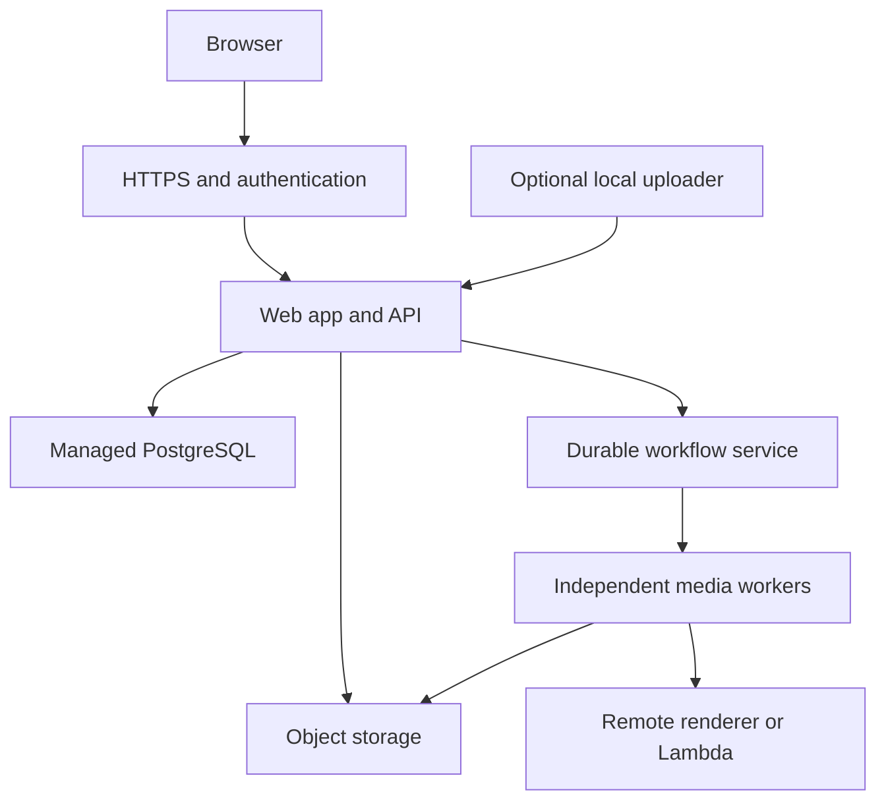

# Katcha availability and compute separation

Audited October 2, 2026 against main `ccafc8c` plus this stability patch. This is a code audit, not a measurement of the operator's Windows/WSL machine. No infrastructure was provisioned and no data was moved.

## Finding

Katcha can become a reliable web app, but the default launcher deployment makes its availability depend on the local machine. Cloud LLM calls do not remove local database, workflow, transcription, media hydration, encoding, and storage work. Reconnect improvements help recovery; keeping the application available while the laptop sleeps requires a remote application host.

| Evidence | Consequence | Action |
| --- | --- | --- |
| `launcher-bridge.js` waited indefinitely for status fetch/body | One stalled request could stop the polling loop indefinitely | Fixed: abort after 8 seconds, then continue polling |
| Launch console had the same unbounded request | Console could stop updating indefinitely | Fixed: status deadline 8 seconds; retry in 2 seconds after failure. Other operations retain a 120-second deadline and are not automatically retried |
| Supervisor workspace readiness was tied to container inventory every 30 seconds when ready | Recovered API could remain marked unavailable until next inventory | Fixed: independent workspace probe every 10 seconds while available, every 2 seconds while unavailable; container checks retain their cadence |
| Compose runs database, Temporal, MinIO, API and several workers on one host without resource limits | Analysis/rendering can compete with interactive requests; all services share the host failure domain | Separate workers from the control plane; measure before choosing limits |
| Analysis executor has 2 threads; production executor has 6, with two Worker instances sharing it | Several expensive activities can overlap; thread counts do not bound asynchronous activity execution | Add explicit Temporal activity slot limits and resource budgets as a separately validated change |
| Renderer concurrency defaults to 1 inside each render call, but HTTP render requests can overlap | “Concurrency 1” does not guarantee one video job at a time | Add render-job admission limits or run separately provisioned rendering workers |
| Renderer can use Lambda but still hydrates media and inspects/uploads output in its own process | Lambda reduces encoding load, but does not remove every local media cost | Run the renderer service remotely too |
| Gateway forwards requests with a 120-second upstream timeout | Feature requests may appear frozen for up to two minutes | Set operation-specific read deadlines, preserve uncertain writes and durable request identities; do not blindly replay POST requests |
| UI feature API helpers generally use unbounded fetch | Status recovery does not guarantee every stalled feature request recovers | Introduce shared request handling with bounded reads and explicit uncertain-write recovery |
| `/v1/health/workspace` checks database; `/v1/health/ready` also checks Temporal | Working app and functioning automation are distinct | Keep UI available with background failures visible; keep these two readiness concepts separate |
| Runtime deliberately avoids repeatedly restarting unhealthy running containers | A persistent deadlock can require intervention even with restart policies | Collect failure evidence; use carefully bounded replacement in a hosted service, not repeated whole-stack restarts |

The patch does not guarantee a 2-second reconnect under CPU exhaustion. Monitor operations can still be delayed by Docker commands, and browsers throttle background tabs. It removes two indefinite waits and one unnecessary readiness delay.

## Recommended deployment

Move the **web application first**, rather than only replacing the laptop or offloading the LLM. Start with an always-on remote application service and separate media workers. Use the existing queues and object keys as the interface between them.

| Option | What it solves | Limits | Judgment |
| --- | --- | --- | --- |
| Tune local runtime | Faster recovery and less resource contention | Sleep, Docker failure, local network and host pressure remain | Immediate bridge, not the final availability solution |
| Remote VM for entire stack | Removes dependence on the laptop and is a simple migration | One host still shares failure/resource risks; backups and database operation remain your responsibility | Reasonable budget-sensitive interim deployment |
| Hosted control plane + separate workers + managed data | Keeps interactive service insulated from encoding/analysis; supports independent scaling and recovery | More infrastructure and recurring cost; requires deployment/authentication work | Recommended target |

An AWS implementation could use ECS services behind an HTTPS load balancer, RDS PostgreSQL, S3, and independent media worker services. Existing Remotion Lambda support can be reused for encoding. Temporal can be privately self-hosted initially or migrated to Temporal Cloud after implementing authenticated/TLS client configuration consistently in API and every worker. Today `Client.connect` is generally supplied host/namespace only; changing a hostname alone is not a Temporal Cloud migration.

Primary references checked for this recommendation:
- [ECS service scheduling and replacement](https://docs.aws.amazon.com/AmazonECS/latest/developerguide/ecs_services.html)
- [Temporal deployment guide](https://docs.temporal.io/self-hosted-guide)
- [Temporal worker ownership](https://docs.temporal.io/temporal)
- [Remotion Lambda](https://www.remotion.dev/docs/lambda)

No instance sizing or cost is asserted without measured traffic, media duration/volume, concurrency and region. A single remote VM is simpler; managed services reduce operational burden and isolate failure, but are not free.

## Migration sequence

1. **Capture the failure.** Run `python scripts/diagnose_runtime.py > katcha-runtime-snapshot.json` from the repository in the affected WSL environment, once idle and once during a disconnect. Export launcher diagnostics as well. The script records only allowed container state/resource fields, not environments or logs. Check OOMKilled, restart counts, memory availability/swap, CPU load, disk space, API readiness and dependency health. Historical logs are needed for failures that have already restarted; OOMKilled on current state is not a complete history.
2. **Deploy recovery patch.** Validate a real disconnect/reconnect without reloading, preserved prompt/form contents, resumed saved goal, and actual failure messages. UI status deadlines do not abort or retry production/publishing requests.
3. **Set measured local budgets if local media must remain temporarily.** Bound simultaneous analysis and render jobs, then cap those containers' CPU/memory with room for API/database. Validate representative ranked/long-form output. A guessed memory cap may just create new OOM failures. Never remove volumes to “repair” availability.
4. **Prepare hosted application.** Container deployment, private database/workflow network, persistent object storage, secret injection, domain/TLS, authentication, observability, backups and tested restoration. The launcher binds loopback and injects a privileged server-side token; it is not a public multiuser identity layer. A hosted gateway must keep tokens out of browser storage and enforce user/channel permissions. OAuth callbacks and host-bound AI connections must be migrated deliberately.
5. **Move durable data safely.** Back up PostgreSQL and media; rehearse restoration; coordinate database cutover and running Temporal workflow histories. Preserve credential-encryption keys with secured backups. Do not start duplicate schedulers or reset workflow history to switch hosts. Retain the old installation until verification passes.
6. **Move heavy workers and renderer.** Shared reachable storage, correct task queues, matching worker code, bounded slots and independent resource budgets. The laptop is no longer required for automation. Do not use public unauthenticated database/Temporal endpoints.
7. **Test host independence.** Turn the local machine off; verify remote browsing, goal progress, one render/review journey, and saved work after API/worker replacement. Verify backups restore and no duplicate publishing occurs before treating this as production ready.

## Acceptance and monitoring

Proposed targets, not measured results: after a responsive API returns, foreground workspace status refreshes within 15 seconds; interactive API p95 stays under 1 second during representative media load; replacing a worker does not erase/replay accepted work. Track successful request latency, timeout/5xx rates, container restarts/OOM events, database pool waits, CPU/memory/disk, workflow task backlog and age, and recovery time. Alert on failures rather than only displaying a green process state.

Local regression: launcher Python tests verify recovered workspace readiness without waiting for container health checks and without restarting healthy services. Browser regression deliberately stalls one status request and requires the bridge to show reconnection and then recover on another request. These are fixtures, not evidence that the operator's local runtime or a hosted deployment meets the targets.
